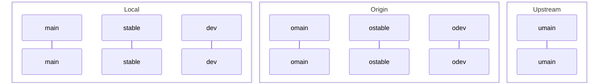

# MediaCMS

## Project Workflow

## Branches

- `main` - upstream branch to keep the original code. 
- `stable` - stable branch to keep the stable code.
- `dev` - development branch, features are merged here.
- `features/*` - feature branches, new features are developed here.

Periodically sync changes from the original repository into this main branch:

