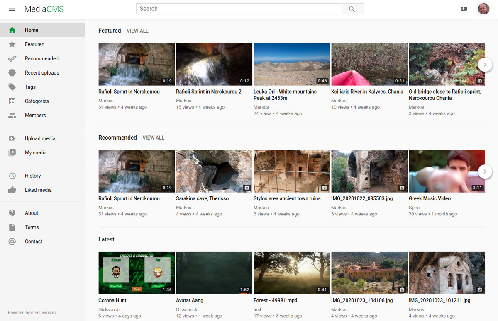
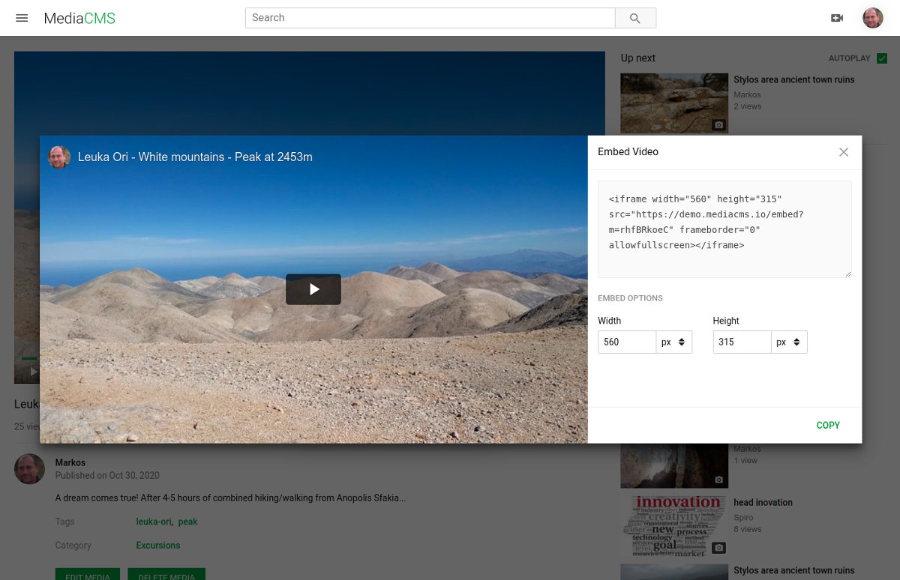

MediaCMS is a modern, fully featured open source video and media CMS. It is developed to meet the needs of modern web platforms for viewing and sharing media. It can be used to build a small to medium video and media portal within minutes. 

It is built mostly using the modern stack Django + React and includes a REST API.

## Screenshots



Vanilla MediaCMS index page


Video page with player different options



Embed video page


## Features
- **Complete control over your data**: host it yourself!
- **Support for multiple publishing workflows**: public, private, unlisted and custom
- **Modern technologies**: Django/Python/Celery, React.
- **Multiple media types support**: video, audio,  image, pdf
- **Multiple media classification options**: categories, tags and custom
- **Multiple media sharing options**: social media share, videos embed code generation
- **Easy media searching**: enriched with live search functionality
- **Playlists for audio and video content**: create playlists, add and reorder content
- **Responsive design**: including light and dark themes
- **Advanced users management**: allow self registration, invite only, closed.
- **Configurable actions**: allow download, add comments, add likes, dislikes, report media
- **Configuration options**: change logos, fonts, styling, add more pages
- **Enhanced video player**: customized video.js player with multiple resolution and playback speed options
- **Multiple transcoding profiles**: sane defaults for multiple dimensions (240p, 360p, 480p, 720p, 1080p) and multiple profiles (h264, h265, vp9)
- **Adaptive video streaming**: possible through HLS protocol
- **Subtitles/CC**: support for multilingual subtitle files
- **Scalable transcoding**: transcoding through priorities. Experimental support for remote workers
- **Chunked file uploads**: for pausable/resumable upload of content


## Example cases

- **Schools, education.** Administrators and editors keep what content will be published, students are not distracted with advertisements and irrelevant content, plus they have the ability to select either to stream or download content.

- **Organization sensitive content.** In cases where content is sensitive and cannot be uploaded to external sites.

- **Build a great community.** MediaCMS can be customized (URLs, logos, fonts, aesthetics) so that you create a highly customized video portal for your community!

- **Personal portal.** Organize, categorize and host your content the way you prefer.


## Philosophy

We believe there's a need for quality open source web applications that can be used to build community portals and support collaboration. 

We have three goals for MediaCMS: a) deliver all functionality one would expect from a modern system, b) allow for easy installation and maintenance, c) allow easy customization and addition of features. 


## License

MediaCMS is released under [GNU Affero General Public License v3.0 license](LICENSE.txt). 
Copyright Markos Gogoulos and Yiannis Stergiou


## Support and paid services

We provide custom installations, development of extra functionality, migration from existing systems, integrations with legacy systems, training and support. Contact us at info@mediacms.io for more information.


## Hardware dependencies

For a small to medium installation, with a few hours of video uploaded daily, and a few hundreds of active daily users viewing content, 4GB Ram / 2-4 CPUs as minimum is ok. For a larger installation with many hours of video uploaded daily, consider adding more CPUs and more Ram.    

In terms of disk space, think of what the needs will be. A general rule is to multiply by three the size of the expected uploaded videos (since the system keeps original versions, encoded versions plus HLS), so if you receive 1G of videos daily and maintain all of them, you should consider a 1T disk across a year (1G * 3 * 365).


## Installation

MediaCMS can be installed through an automated script that installs and configures all needed services on a single server, and through Docker Compose.

### Docker Compose installation
With a recent version of Docker Compose installed, run as root


```bash
git clone https://github.com/mediacms-io/mediacms
cd mediacms
docker-compose build && docker-compose up
```

This will build an image, download and setup necessary images and start all containers. Once it finishes, MediaCMS will be installed on http://localhost

For more instructions, checkout the docs on the [Docker deployment](docs/Docker_deployment.md) page. Docker Compose support has been contributed by @swiftugandan.


### Single server installation

The core dependencies are Python3, Django3, Celery, PostgreSQL, Redis, ffmpeg. Any system that can have these dependencies installed, can run MediaCMS. But we strongly suggest installing on Linux Ubuntu 18 or 20 versions.

Installation on a Ubuntu 18 or 20 system with git utility installed should be completed in a few minutes with the following steps.
Make sure you run it as user root, on a clear system, since the automatic script will install and configure the following services: Celery/PostgreSQL/Redis/Nginx and will override any existing settings. 

Automated script - to run on Ubuntu 18 or Ubuntu 20 flavors only!

```bash
mkdir /home/mediacms.io && cd /home/mediacms.io/
git clone https://github.com/mediacms-io/mediacms
cd /home/mediacms.io/mediacms/ && bash ./install.sh
```

The script will ask if you have a URL where you want to deploy MediaCMS, otherwise it will use localhost. If you provide a URL, it will use Let's Encrypt service to install a valid ssl certificate. 


## Update

If you've used the above way to install MediaCMS, update with the following:

```bash
cd /home/mediacms.io/mediacms # enter mediacms directory
source  /home/mediacms.io/bin/activate # use virtualenv
git pull # update code
python manage.py migrate # run Django migrations
sudo systemctl restart mediacms celery_long celery_short # restart services
```


## Configure

Several options are available on cms/settings.py, most of the things that are allowed or should be disallowed are described there. It is advisable to override any of them by adding it to cms/local_settings.py. All configuration options will be documented gradually on the [Configuration](docs/Configuration.md) page.

## Authors
MediaCMS is developed by Yiannis Stergiou and Markos Gogoulos. We are Wordgames - https://wordgames.gr. 


## Technology
This software uses the following list of awesome technologies:
- Python
- Django
- Django Rest Framework
- Celery
- PostgreSQL
- Redis
- Nginx
- uWSGI
- React
- Fine Uploader
- video.js
- FFMPEG
- Bento4


## Who is using it

- **EngageMedia** non-profit media, technology and culture organization - https://video.engagemedia.org

- **Critical Commons** public media archive and fair use advocacy network - https://criticalcommons.org

- **Heritales** International Heritage Film Festival - https://stage.heritales.org


## Thanks To

- **Anna Helme**, for such a great partnership all these years!

- **Steve Anderson**, for trusting us and helping the Wordgames team make this real.

- **Andrew Lowenthal, King Catoy, Rezwan Islam** and the rest of the great team of [Engage Media](https://engagemedia.org). 

- **Ioannis Korovesis, Ioannis Maistros, Diomidis Spinellis and Theodoros Karounos**, for their mentorship all these years, their contribution to science and the promotion of open source and free software technologies.

- **Antonis Ikonomou**, for hosting us on the excellent [Innovathens](https://www.innovathens.gr) space.

- **Werner Robitza**, for helping us with ffmpeg related stuff.


## How to contribute

If you like the project, here's a few things you can do
- Hire us, for custom installations, training, support, maintenance work
- Suggest us to others that are interested to hire us
- Write a blog post/article about MediaCMS
- Share on social media about the project
- Open issues, participate on discussions, report bugs, suggest ideas
- Star the project
- Add functionality, work on a PR, fix an issue! 

## Contact
info@mediacms.io
