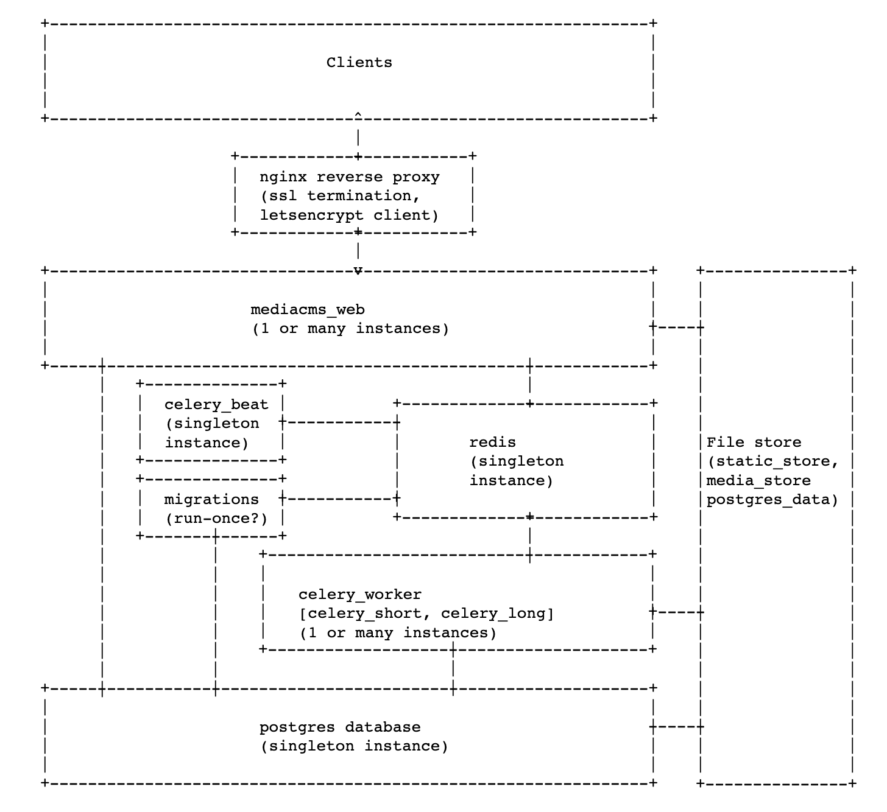
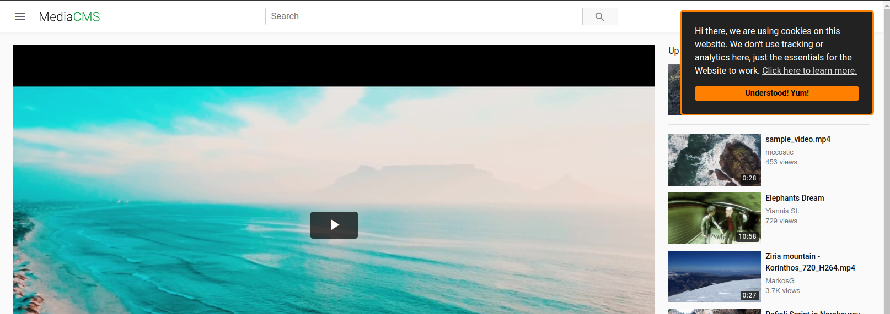

# Administrators documentation

## Table of contents
- [1. Welcome](#1-welcome)
- [2. Server Installaton](#2-server-installation)
- [3. Docker Installation](#3-docker-installation)
- [4. Docker Deployment options](#4-docker-deployment-options)
- [5. Configuration](#5-configuration)
- [6. Manage pages](#6-manage-pages)
- [7. Django admin dashboard](#7-django-admin-dashboard)
- [8. On portal workflow](#8-on-portal-workflow)
- [9. On user roles](#9-on-user-roles)
- [10. Adding languages for Captions and subtitles](#10-adding-languages-for-captions-and-subtitles)
- [11. Add/delete categories and tags](#11-adddelete-categories-and-tags)
- [12. Video transcoding](#12-video-transcoding)
- [13. How To Add A Static Page To The Sidebar](#13-how-to-add-a-static-page-to-the-sidebar)
- [14. Add Google Analytics](#14-add-google-analytics)
- [15. Debugging email issues](#15-debugging-email-issues)
- [16. Frequently Asked Questions](#16-frequently-asked-questions)
- [17. Cookie consent code](#17-cookie-consent-code)
- [18. Disable encoding and show only original file](#18-disable-encoding-and-show-only-original-file)
- [19. Rounded corners on videos](#19-rounded-corners)

## 1. Welcome
This page is created for MediaCMS administrators that are responsible for setting up the software, maintaining it and making modifications.

## 2. Server Installation

The core dependencies are Python3, Django3, Celery, PostgreSQL, Redis, ffmpeg. Any system that can have these dependencies installed, can run MediaCMS. But we strongly suggest installing on Linux Ubuntu (tested on versions 20, 22).

Installation on an Ubuntu system with git utility installed should be completed in a few minutes with the following steps.
Make sure you run it as user root, on a clear system, since the automatic script will install and configure the following services: Celery/PostgreSQL/Redis/Nginx and will override any existing settings.

Automated script - tested on Ubuntu 20, Ubuntu 22 and Debian Buster

```bash
mkdir /home/mediacms.io && cd /home/mediacms.io/
git clone https://github.com/mediacms-io/mediacms
cd /home/mediacms.io/mediacms/ && bash ./install.sh
```

The script will ask if you have a URL where you want to deploy MediaCMS, otherwise it will use localhost. If you provide a URL, it will use Let's Encrypt service to install a valid ssl certificate.


### Update

If you've used the above way to install MediaCMS, update with the following:

```bash
cd /home/mediacms.io/mediacms # enter mediacms directory
source  /home/mediacms.io/bin/activate # use virtualenv
git pull # update code
pip install -r requirements.txt -U # run pip install to update
python manage.py migrate # run Django migrations
sudo systemctl restart mediacms celery_long celery_short # restart services
```

### Update from version 2 to version 3
Version 3 is using Django 4 and Celery 5, and needs a recent Python 3.x version. If you are updating from an older version, make sure Python is updated first. Version 2 could run on Python 3.6, but version 3 needs Python3.8 and higher.
The syntax for starting Celery has also changed, so you have to copy the celery related systemctl files and restart

```
# cp deploy/local_install/celery_long.service /etc/systemd/system/celery_long.service
# cp deploy/local_install/celery_short.service /etc/systemd/system/celery_short.service
# cp deploy/local_install/celery_beat.service /etc/systemd/system/celery_beat.service
# systemctl daemon-reload
# systemctl start celery_long celery_short celery_beat
```


### Configuration
Checkout the configuration section here.


### Maintenance
Database can be backed up with pg_dump and media_files on /home/mediacms.io/mediacms/media_files include original files and encoded/transcoded versions


## 3. Docker Installation

## Installation
Install a recent version of [Docker](https://docs.docker.com/get-docker/), and [Docker Compose](https://docs.docker.com/compose/install/).

For Ubuntu 20/22 systems this is:

```bash
curl -fsSL https://get.docker.com -o get-docker.sh
sudo sh get-docker.sh
sudo curl -L "https://github.com/docker/compose/releases/download/1.29.2/docker-compose-$(uname -s)-$(uname -m)" -o /usr/local/bin/docker-compose
sudo chmod +x /usr/local/bin/docker-compose
```

Then run as root

```bash
git clone https://github.com/mediacms-io/mediacms
cd mediacms
```

The default option is to serve MediaCMS on all ips available of the server (including localhost).
If you want to explore more options (including setup of https with letsencrypt certificate) checkout [Docker deployment](/docs/admins_docs.md#4-docker-deployment-options) section for different docker-compose setups to use.

Run

```bash
docker-compose up
```

This will download all MediaCMS related Docker images and start all containers. Once it finishes, MediaCMS will be installed and available on http://localhost or http://ip

A user admin has been created with random password, you should be able to see it at the end of migrations container, eg

```
migrations_1     | Created admin user with password: gwg1clfkwf
```

or if you have set the ADMIN_PASSWORD variable on docker-compose file you have used (example `docker-compose.yaml`), that variable will be set as the admin user's password

### Update

Get latest MediaCMS image and stop/start containers

```bash
cd /path/to/mediacms/installation
docker pull mediacms/mediacms
docker-compose down
docker-compose up
```

### Update from version 2 to version 3
Version 3 is using Python 3.11 and PostgreSQL 15. If you are updating from an older version, that was using PostgreSQL 13, the automatic update will not work, as you will receive the following message when the PostgreSQL container starts:

```
db_1              | 2023-06-27 11:07:42.959 UTC [1] FATAL:  database files are incompatible with server
db_1              | 2023-06-27 11:07:42.959 UTC [1] DETAIL:  The data directory was initialized by PostgreSQL version 13, which is not compatible with this version 15.2.
```

At this point there are two options: either edit the Docker Compose file and make use of the existing postgres:13 image, or otherwise you have to perform the migration from postgresql 13 to version 15. More notes on https://github.com/mediacms-io/mediacms/pull/749


## Configuration
Checkout the configuration docs here.


### Maintenance
Database is stored on ../postgres_data/ and media_files on media_files/


## 4. Docker Deployment options

The mediacms image is built to use supervisord as the main process, which manages one or more services required to run mediacms. We can toggle which services are run in a given container by setting the environment variables below to `yes` or `no`:

* ENABLE_UWSGI
* ENABLE_NGINX
* ENABLE_CELERY_BEAT
* ENABLE_CELERY_SHORT
* ENABLE_CELERY_LONG
* ENABLE_MIGRATIONS

By default, all these services are enabled, but in order to create a scaleable deployment, some of them can be disabled, splitting the service up into smaller services.

Also see the `Dockerfile` for other environment variables which you may wish to override. Application settings, eg. `FRONTEND_HOST` can also be overridden by updating the `deploy/docker/local_settings.py` file.

See example deployments in the sections below. These example deployments have been tested on `docker-compose version 1.27.4` running on `Docker version 19.03.13`

To run, update the configs above if necessary, build the image by running `docker-compose build`, then run `docker-compose run`

### Simple Deployment, accessed as http://localhost

The main container runs migrations, mediacms_web, celery_beat, celery_workers (celery_short and celery_long services), exposed on port 80 supported by redis and postgres database.

 The FRONTEND_HOST in `deploy/docker/local_settings.py` is configured as http://localhost, on the docker host machine.

### Server with ssl certificate through letsencrypt service, accessed as https://my_domain.com
Before trying this out make sure the ip points to my_domain.com.

With this method [this deployment](../docker-compose-letsencrypt.yaml) is used.

Edit this file and set `VIRTUAL_HOST` as my_domain.com, `LETSENCRYPT_HOST` as my_domain.com, and your email on `LETSENCRYPT_EMAIL`

Edit `deploy/docker/local_settings.py` and set https://my_domain.com as `FRONTEND_HOST`

Now run docker-compose -f docker-compose-letsencrypt.yaml up, when installation finishes you will be able to access https://my_domain.com using a valid Letsencrypt certificate!

### Advanced Deployment, accessed as http://localhost:8000

Here we can run 1 mediacms_web instance, with the FRONTEND_HOST in `deploy/docker/local_settings.py` configured as http://localhost:8000. This is bootstrapped by a single migrations instance and supported by a single celery_beat instance and 1 or more celery_worker instances. Redis and postgres containers are also used for persistence. Clients can access the service on http://localhost:8000, on the docker host machine. This is similar to [this deployment](../docker-compose.yaml), with a `port` defined in FRONTEND_HOST.

### Advanced Deployment, with reverse proxy, accessed as http://mediacms.io

Here we can use `jwilder/nginx-proxy` to reverse proxy to 1 or more instances of mediacms_web supported by other services as mentioned in the previous deployment. The FRONTEND_HOST in `deploy/docker/local_settings.py` is configured as http://mediacms.io, nginx-proxy has port 80 exposed. Clients can access the service on http://mediacms.io (Assuming DNS or the hosts file is setup correctly to point to the IP of the nginx-proxy instance). This is similar to [this deployment](../docker-compose-http-proxy.yaml).

### Advanced Deployment, with reverse proxy, accessed as https://localhost

The reverse proxy (`jwilder/nginx-proxy`) can be configured to provide SSL termination using self-signed certificates, letsencrypt or CA signed certificates (see: https://hub.docker.com/r/jwilder/nginx-proxy or [LetsEncrypt Example](https://www.singularaspect.com/use-nginx-proxy-and-letsencrypt-companion-to-host-multiple-websites/) ). In this case the FRONTEND_HOST should be set to https://mediacms.io. This is similar to [this deployment](../docker-compose-http-proxy.yaml).

### A Scaleable Deployment Architecture (Docker, Swarm, Kubernetes)

The architecture below generalises all the deployment scenarios above, and provides a conceptual design for other deployments based on kubernetes and docker swarm. It allows for horizontal scaleability through the use of multiple mediacms_web instances and celery_workers. For large deployments, managed postgres, redis and storage may be adopted.




## 5. Configuration
Several options are available on `cms/settings.py`, most of the things that are allowed or should be disallowed are described there.

It is advisable to override any of them by adding it to `local_settings.py` .

In case of a the single server installation, add to `cms/local_settings.py` .

In case of a docker compose installation, add to `deploy/docker/local_settings.py` . This will automatically overwrite `cms/local_settings.py` .

Any change needs restart of MediaCMS in order to take effect.

Single server installation: edit `cms/local_settings.py`, make a change and restart MediaCMS

```bash
#systemctl restart mediacms
```

Docker Compose installation: edit `deploy/docker/local_settings.py`, make a change and restart MediaCMS containers

```bash
#docker-compose restart web celery_worker celery_beat
```

### 5.1 Change portal logo

Set a new svg file for the white theme (`static/images/logo_dark.svg`) or the dark theme (`static/images/logo_light.svg`)

### 5.2 Set global portal title

set `PORTAL_NAME`, eg

```
PORTAL_NAME = 'my awesome portal'
```

### 5.3 Control who can add media

By default `CAN_ADD_MEDIA = "all"` means that all registered users can add media. Other valid options are:

- **email_verified**, a user not only has to register an account but also verify the email (by clicking the link sent upon registration). Apparently email configuration need to work, otherise users won't receive emails.

- **advancedUser**, only users that are marked as advanced users can add media. Admins or MediaCMS managers can make users advanced users by editing their profile and selecting advancedUser.

### 5.4 What is the portal workflow

The `PORTAL_WORKFLOW` variable specifies what happens to newly uploaded media, whether they appear on listings (as the index page, or search)

- **public** is the default option and means that a media can appear on listings. If media type is video, it will appear once at least a task that produces an encoded version of the file has finished succesfully. For other type of files, as image/audio they appear instantly

- **private** means that newly uploaded content is private - only users can see it or MediaCMS editors, managers and admins. Those can also set the status to public or unlisted

- **unlisted** means that items are unlisted. However if a user visits the url of an unlisted media, it will be shown (as opposed to private)


### 5.5 Show or hide the Sign in button

to show button:
```
LOGIN_ALLOWED = True
```

to hide button:

```
LOGIN_ALLOWED = False
```

### 5.6 Show or hide the Register button

to show button:
```
REGISTER_ALLOWED = True
```

to hide button:

```
REGISTER_ALLOWED = False
```


### 5.7 Show or hide the upload media button

To show:

```
UPLOAD_MEDIA_ALLOWED = True
```

To hide:

```
UPLOAD_MEDIA_ALLOWED = False
```

### 5.8 Show or hide the actions buttons (like/dislike/report)

Make changes (True/False) to any of the following:

```
- CAN_LIKE_MEDIA = True  # whether the like media appears
- CAN_DISLIKE_MEDIA = True  # whether the dislike media appears
- CAN_REPORT_MEDIA = True  # whether the report media appears
- CAN_SHARE_MEDIA = True  # whether the share media appears
```

### 5.9 Show or hide the download option on a media

Edit `templates/config/installation/features.html` and set

```
download: false
```

### 5.10 Automatically hide media upon being reported

set a low number for variable `REPORTED_TIMES_THRESHOLD`
eg

```
REPORTED_TIMES_THRESHOLD = 2
```

once the limit is reached, media goes to private state and an email is sent to admins

### 5.11 Set a custom message on the media upload page

this message will appear below the media drag and drop form

```
PRE_UPLOAD_MEDIA_MESSAGE = 'custom message'
```

### 5.12 Set email settings

Set correct settings per provider

```
DEFAULT_FROM_EMAIL = 'info@mediacms.io'
EMAIL_HOST_PASSWORD = 'xyz'
EMAIL_HOST_USER = 'info@mediacms.io'
EMAIL_USE_TLS = True
SERVER_EMAIL = DEFAULT_FROM_EMAIL
EMAIL_HOST = 'mediacms.io'
EMAIL_PORT = 587
ADMIN_EMAIL_LIST = ['info@mediacms.io']
```

### 5.13 Disallow user registrations from specific domains

set domains that are not valid for registration via this variable:

```
RESTRICTED_DOMAINS_FOR_USER_REGISTRATION = [
    'xxx.com', 'emaildomainwhatever.com']
```

### 5.14 Require a review by MediaCMS editors/managers/admins

set value

```
MEDIA_IS_REVIEWED = False
```

any uploaded media now needs to be reviewed before it can appear to the listings.
MediaCMS editors/managers/admins can visit the media page and edit it, where they can see the option to mark media as reviewed. By default this is set to True, so all media don't require to be reviewed

### 5.15 Specify maximum number of media for a playlist

set a different threshold on variable `MAX_MEDIA_PER_PLAYLIST`

eg

```
MAX_MEDIA_PER_PLAYLIST = 14
```

### 5.16 Specify maximum size of a media that can be uploaded

change `UPLOAD_MAX_SIZE`.

default is 4GB

```
UPLOAD_MAX_SIZE = 800 * 1024 * 1000 * 5
```

### 5.17 Specify maximum size of comments

change `MAX_CHARS_FOR_COMMENT`

default:

```
MAX_CHARS_FOR_COMMENT = 10000
```

### 5.18 How many files to upload in parallel

set a different threshold for `UPLOAD_MAX_FILES_NUMBER`
default:

```
UPLOAD_MAX_FILES_NUMBER = 100
```

### 5.18 force users confirm their email upon registrations

default option for email confirmation is optional. Set this to mandatory in order to force users confirm their email before they can login

```
ACCOUNT_EMAIL_VERIFICATION = 'optional'
```

### 5.20 Rate limit account login attempts

after this number is reached

```
ACCOUNT_LOGIN_ATTEMPTS_LIMIT = 20
```

sets a timeout (in seconds)

```
ACCOUNT_LOGIN_ATTEMPTS_TIMEOUT = 5
```

### 5.21 Disallow user registration

set the following variable to False

```
USERS_CAN_SELF_REGISTER = True
```

### 5.22 Configure notifications

Global notifications that are implemented are controlled by the following options:

```
USERS_NOTIFICATIONS = {
    'MEDIA_ADDED': True,
}
```

If you want to disable notification for new media, set to False

Admins also receive notifications on different events, set any of the following to False to disable

```
ADMINS_NOTIFICATIONS = {
    'NEW_USER': True,
    'MEDIA_ADDED': True,
    'MEDIA_REPORTED': True,
}
```

- NEW_USER: a new user is added
- MEDIA_ADDED: a media is added
- MEDIA_REPORTED: the report for a media was hit

### 5.23 Configure only member access to media

- Make the portal workflow public, but at the same time set `GLOBAL_LOGIN_REQUIRED = True` so that only logged in users can see content.
- You can either set `REGISTER_ALLOWED = False` if you want to add members yourself or checkout options on "django-allauth settings" that affects registration in `cms/settings.py`. Eg set the portal invite only, or set email confirmation as mandatory, so that you control who registers.

### 5.24 Enable the sitemap

Whether or not to enable generation of a sitemap file at http://your_installation/sitemap.xml (default: False)

```
GENERATE_SITEMAP = False
```


### 5.25 Control who can add comments

By default `CAN_COMMENT = "all"` means that all registered users can add comment. Other valid options are:

- **email_verified**, a user not only has to register an account but also verify the email (by clicking the link sent upon registration). Apparently email configuration need to work, otherise users won't receive emails.

- **advancedUser**, only users that are marked as advanced users can add comment. Admins or MediaCMS managers can make users advanced users by editing their profile and selecting advancedUser.


## 6. Manage pages
to be written

## 7. Django admin dashboard

## 8. On portal workflow
Who can publish content, how content appears on public listings.Difference between statuses (private, unlisted, public)

## 9. On user roles
Differences over MediaCMS manager, MediaCMS editor, logged in user

## 10. Adding languages for Captions and subtitles
to be written

## 11. Add/delete categories and tags
Through the admin section - http://your_installation/admin/

## 12. Video transcoding
Add / remove resolutions and profiles by modifying the database table of `Encode profiles` through https://your_installation/admin/files/encodeprofile/

For example, the `Active` state of any profile can be toggled to enable or disable it.

## 13. How To Add A Static Page To The Sidebar

### 1. Create your html page in templates/cms/
e.g. duplicate and rename about.html
```
sudo cp templates/cms/about.html templates/cms/volunteer.html
```

### 2. Create your css file in static/css/
```
touch static/css/volunteer.css
```

### 3. In your html file, update block headermeta to reflect your new page
```

<meta property="og:title" content="Volunteer - {{PORTAL_NAME}}">
<meta property="og:type" content="website">
<meta property="og:description" content="">
<meta name="twitter:card" content="summary">
<script type="application/ld+json">
{
	"@context": "https://schema.org",
	"@type": "BreadcrumbList",
	"itemListElement": [{
		"@type": "ListItem",
		"position": 1,
        "name": "{{PORTAL_NAME}}",
        "item": {
			"@type": "WebPage",
	        "@id": "{{FRONTEND_HOST}}"
	    }
    },
    {
		"@type": "ListItem",
		"position": 2,
        "name": "Volunteer",
        "item": {
			"@type": "VolunteerPage",
	        "@id": "{{FRONTEND_HOST}}/volunteer"
	    }
    }]
}
</script>
<link href="" rel="stylesheet"/>

```

### 4. In your html file, update block innercontent to reflect your actual content
Write whatever you like.

### 5. In your css file, write matching styles for you html file.
Write whatever you like.

### 6. Add your view to files/views.py
```
def volunteer(request):
    """Volunteer view"""
    context = {}
    return render(request, "cms/volunteer.html", context)
```

### 7. Add your url pattern to files/urls.py
```
urlpatterns = [
    url(r"^$", views.index),
    url(r"^about", views.about, name="about"),
    url(r"^volunteer", views.volunteer, name="volunteer"),
```

### 8. Add your page to the left sidebar
To add a link to your page as a menu item in the left sidebar,
add the following code after the last line in _commons.js
```
/* Checks that a given selector has loaded. */
const checkElement = async selector => {
    while ( document.querySelector(selector) === null) {
      await new Promise( resolve =>  requestAnimationFrame(resolve) )
    }
    return document.querySelector(selector);
  };

/* Checks that sidebar nav menu has loaded, then adds menu item. */
checkElement('.nav-menu')
.then((element) => {
     (function(){
        var a = document.createElement('a');
        a.href = "/volunteer";
        a.title = "Volunteer";

        var s = document.createElement('span');
        s.className = "menu-item-icon";

        var icon = document.createElement('i');
        icon.className = "material-icons";
        icon.setAttribute("data-icon", "people");

        s.appendChild(icon);
        a.appendChild(s);

        var linkText = document.createTextNode("Volunteer");
        var t = document.createElement('span');

        t.appendChild(linkText);
        a.appendChild(t);

        var listItem = document.createElement('li');
        listItem.className = "link-item";
        listItem.appendChild(a);

        //if signed out use 3rd nav-menu
        var elem = document.querySelector(".nav-menu:nth-child(3) nav ul");
        var loc = elem.innerText;
        if (loc.includes("About")){
          elem.insertBefore(listItem, elem.children[2]);
        } else { //if signed in use 4th nav-menu
          elem = document.querySelector(".nav-menu:nth-child(4) nav ul");
          elem.insertBefore(listItem, elem.children[2]);
        }
    })();
});
```

### 9. Restart the mediacms web server
On docker:
```
sudo docker stop mediacms_web_1 && sudo docker start mediacms_web_1
```

Otherwise
```
sudo systemctl restart mediacms
```


## 14. Add Google Analytics
Instructions contributed by @alberto98fx

1. Create a file:

``` touch $DIR/mediacms/templates/tracking.html ```

2. Add the Gtag/Analytics script

3. Inside ``` $DIR/mediacms/templates/root.html``` you'll see a file like this one:

```
<head>
    

        <title>{{PORTAL_NAME}}</title>

        

        

        <meta property="og:title" content="{{PORTAL_NAME}}">
        <meta property="og:type" content="website">

        

        

        

        

        

    

</head>
```

4. Add  ```  ``` at the end inside the section ```<head>```

5. If you are using Docker and didn't  mount the entire dir you need to bind a new volume:
```

    web:
    image: mediacms/mediacms:latest
    restart: unless-stopped
    ports:
      - "80:80"
    deploy:
      replicas: 1
    volumes:
      - ./templates/root.html:/home/mediacms.io/mediacms/templates/root.html
      - ./templates/tracking.html://home/mediacms.io/mediacms/templates/tracking.html

 ```

## 15. Debugging email issues
On the [Configuration](https://github.com/mediacms-io/mediacms/blob/main/docs/admins_docs.md#5-configuration) section of this guide we've see how to edit the email settings.
In case we are yet unable to receive email from MediaCMS, the following may help us debug the issue - in most cases it is an issue of setting the correct username, password or TLS option

Enter the Django shell, example if you're using the Single Server installation:

```bash
source  /home/mediacms.io/bin/activate
python manage.py shell
```

and inside the shell

```bash
from django.core.mail import EmailMessage
from django.conf import settings

settings.EMAIL_BACKEND = 'django.core.mail.backends.smtp.EmailBackend'

email = EmailMessage(
    'title',
    'msg',
    settings.DEFAULT_FROM_EMAIL,
    ['recipient@email.com'],
)
email.send(fail_silently=False)
```

You have the chance to either receive the email (in this case it will be sent to recipient@email.com) otherwise you will see the error.
For example, while specifying wrong password for my Gmail account I get

```
SMTPAuthenticationError: (535, b'5.7.8 Username and Password not accepted. Learn more at\n5.7.8  https://support.google.com/mail/?p=BadCredentials d4sm12687785wrc.34 - gsmtp')
```

## 16. Frequently Asked Questions
Video is playing but preview thumbnails are not showing for large video files

Chances are that the sprites file was not created correctly.
The output of files.tasks.produce_sprite_from_video() function in this case is something like this

```
convert-im6.q16: width or height exceeds limit `/tmp/img001.jpg' @ error/cache.c/OpenPixelCache/3912.
```

Solution: edit file `/etc/ImageMagick-6/policy.xml` and set bigger values for the lines that contain width and height. For example

```
  <policy domain="resource" name="height" value="16000KP"/>
  <policy domain="resource" name="width" value="16000KP"/>
```

Newly added video files now will be able to produce the sprites file needed for thumbnail previews. To re-run that task on existing videos, enter the Django shell


```
root@8433f923ccf5:/home/mediacms.io/mediacms# source  /home/mediacms.io/bin/activate
root@8433f923ccf5:/home/mediacms.io/mediacms# python manage.py shell
Python 3.8.14 (default, Sep 13 2022, 02:23:58)
```

and run

```
In [1]: from files.models import Media
In [2]: from files.tasks import produce_sprite_from_video

In [3]: for media in Media.objects.filter(media_type='video', sprites=''):
   ...:     produce_sprite_from_video(media.friendly_token)
```

this will re-create the sprites for videos that the task failed.


## 17. Cookie consent code
On file `templates/components/header.html` you can find a simple cookie consent code. It is commented, so you have to remove the `` and `` lines in order to enable it. Or you can replace that part with your own code that handles cookie consent banners.



## 18. Disable encoding and show only original file
When videos are uploaded, they are getting encoded to multiple resolutions, a procedure called transcoding. Sometimes this is not needed and you only need to show the original file, eg when MediaCMS is running on a low capabilities server. To achieve this, edit settings.py and set

```
DO_NOT_TRANSCODE_VIDEO = True
```

This will disable the transcoding process and only the original file will be shown. Note that this will also disable the sprites file creation, so you will not have the preview thumbnails on the video player.

## 19. Rounded corners on videos

By default the video player and media items are now having rounded corners, on larger screens (not in mobile). If you don't like this change, remove the `border-radius` added on the following files:

```
frontend/src/static/css/_extra.css
frontend/src/static/js/components/list-item/Item.scss
frontend/src/static/js/components/media-page/MediaPage.scss
```
you now have to re-run the frontend build in order to see the changes (check docs/dev_exp.md)
