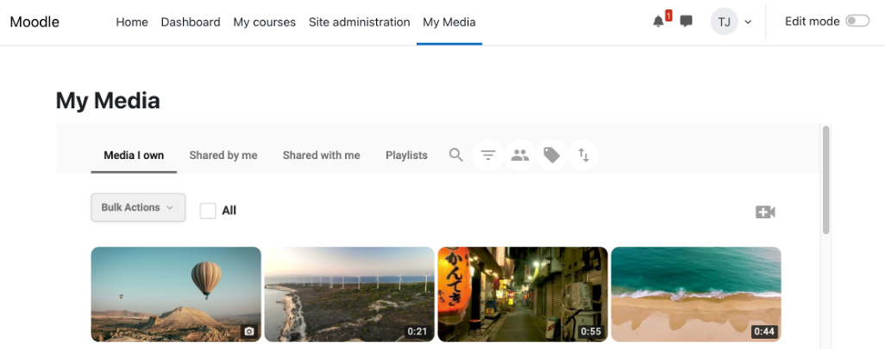

# MediaCMS plugin for Moodle

## Documentation and user guides

The MediaCMS plugin brings a fully featured video content management system directly into Moodle, empowering institutions and their users with powerful media tools — all within a familiar learning environment.

At its core, MediaCMS offers a robust transcoding, transcription, and translation engine, alongside a comprehensive toolbox tailored for administrators, lecturers, students, and staff alike. Its intuitive interface and streamlined workflows mean that most media files can be uploaded, reviewed, edited, and published quickly — with no transcoding delays and no steep learning curve.

This guide covers everything needed to get started: from installation and configuration to everyday use — with dedicated sections for administrators, lecturers, and students.



## 1. For Administrators

Administrators: Installation and configuration of MediaCMS plugin for Moodle

**Prerequisites**

The MediaCMS integration in Moodle should use the same domain as the Moodle portal (further explanation in note 1 below)

E.g. `moodle.organisation.org` versus `mediacms.organisation.org`

### 1.1 Configure MediaCMS `local_settings.py` settings

```
USE_IDENTITY_PROVIDERS = True
USE_RBAC = True
USE_LTI = True
```

Restart MediaCMS services.

### 1.2 Moodle: Add External Tool

Moodle > Site Administration > Plugins > Activity Modules > External tools > Manage Tools > Configure a Tool Manually:

**Tool Settings**
- **Name:** MediaCMS
- **Tool URL:** MediaCMS issuer URL + `/lti/launch/` (e.g. `https://mediacms.organisation.org/lti/launch/`)
- **LTI version:** LTI 1.3
- **Client ID:** will be provided once the tool is saved
- **Public key type:** Keyset URL
- **Public keyset:** MediaCMS issuer URL + `/lti/jwks/` (e.g. `https://mediacms.organisation.org/lti/jwks/`)
- **Initiate login URL:** MediaCMS issuer URL + `/lti/oidc/login/` (e.g. `https://mediacms.organisation.org/lti/oidc/login/`)
- **Redirection URI(s):** MediaCMS issuer URL + `/lti/launch/` (e.g. `https://mediacms.organisation.org/lti/launch/`)
- **Tool configuration usage:** Show in activity chooser and as a preconfigured tool
- **Default launch container:** Embed, without blocks + Supports Deep Linking

**Services**
- **IMS LTI Assignment and Grade Services:** Do not use this service
- **IMS LTI Names and Role Provisioning:** Use this service to retrieve members' information as per privacy settings
- **Tool Settings:** Use this service

**Privacy**
- **Share launcher's name with tool:** Always
- **Share launcher's email with tool:** Always
- **Accept grades from the tool:** As specified in Deep Linking definition or Delegate to teacher

Save Changes.

### 1.3 Moodle: Installation and configuration of MediaCMS plugin in Moodle

#### 1.3.1 Download plugins and install MediaCMS as an LTI tool

The integration consists of **two plugins** that work together:

- **`filter_mediacms`** — the text filter that provides the shared core settings (MediaCMS URL, LTI tool) and securely embeds media via LTI 1.3.
- **`tiny_mediacms`** — the TinyMCE editor button used to insert MediaCMS media. It depends on `filter_mediacms`.

Both plugins (as ZIP files) are available from the [`lms-plugins/mediacms-moodle/dist/`](https://github.com/mediacms-io/mediacms/tree/main/lms-plugins/mediacms-moodle/dist) directory of this repository.

They have also been submitted to the [Moodle Plugins directory](https://moodle.org/plugins) and are pending approval. Once approved, they will be available at:

- https://moodle.org/plugins/filter_mediacms
- https://moodle.org/plugins/tiny_mediacms

**Install order:** install `filter_mediacms` first, then `tiny_mediacms`. The editor plugin declares a hard dependency on the filter, so Moodle will not let you install `tiny_mediacms` until `filter_mediacms` is present.

The recommended way to install each plugin is via Moodle's ZIP upload mechanism:

- **A. Install plugins via** Moodle > Site Administration > Install plugins. Upload `filter_mediacms` first, complete the installation, then upload `tiny_mediacms`. Benefit: Easy manual workflow.
- **B. Copy files from ZIP to the Moodle folder structure.** Benefit: This method can be automated.
  - Unzip `filter_mediacms` into the `filter/` directory and `tiny_mediacms` into the `lib/editor/tiny/plugins/` directory of your Moodle installation (e.g. under `/var/www/moodle/public`).
  - Open Moodle and the installation should start automatically.

#### 1.3.2 Configuration of plugin: Site Administration > ...

- [ ] Plugins > Filters > Manage Filters > MediaCMS > Enable, and place in top of list
- [ ] Plugins > Filters > MediaCMS >
  - [ ] My Media link placement: Top Navigation or User Navigation (further explanation in note 2 below)
  - [ ] MediaCMS URL: e.g. `mediacms.organisation.org`
  - [ ] LTI Tool: e.g. `mediacms.organisation.org/lti/launch/`
  - [ ] Share Embedded Media (whether embedded media can be accessed via My Media > Shared with Me) (note 3 below)
- [ ] Plugins > Text editors > TinyMCE > MediaCMS > sets default embed options for users
  - [ ] Show video title (media title option on top of video)
  - [ ] Link video title (media title option on top of video linking to full media playback options: download, comments etc.)
  - [ ] Show user avatar (show user's icon picture on top of video)

**Notes:**

**Note 1.** As of Q2 2026 browser providers increasingly implement measures to prevent cross-site tracking, which also set limitations on how users can view embedded content from a system X (e.g. MediaCMS), that has been embedded in system Y (e.g. Moodle). To avoid these limitations, it is recommended to use the same domain for the configuration of MediaCMS as is used for Moodle.

**Note 2.** User Navigation is the user's icon in top right corner of Moodle interface, where user profile and preferences are found.

**Note 3.** "Share Embedded Media" configuration explained:

Users are automatically assigned permissions to embedded media in Moodle Activity/Resource, if they have access to a particular Moodle Activity / Resource. Publish State of the media is set to Private and Shared, whereby media cannot be shared outside Moodle by e.g. copying a link from Moodle and using it outside Moodle. These permissions are not automatically removed, if access to the Moodle Activity/Resource is removed.

Users listed as sharing partners can be removed manually via My Media > Bulk Actions > Course Cleanup > select course > "Remove present course permissions for all course members" > Proceed. Users can still access the media in Moodle Activities / Resources, if that access is given in Moodle, whereby user will again become sharing partner, if making use of that access.

**Option 1: Share Embedded Media = True**

With this configuration users, who have accessed embedded media, can also access this media via My Media > Shared with Me. This is possible in My Media in Moodle as well as My Media in the MediaCMS video portal.

**Option 2: Share Embedded Media = False**

Select this option, if users should not have access to embedded content under My Media > Shared with Me. Select this option, if strict access control should be handled for embedded content, and not rely on e.g. manual Course Cleanup procedures.

### 1.4 MediaCMS Administration: Add Moodle as an LTI platform

In MediaCMS, go to Administration > LTI 1.3 Integration > LTI Platforms > Add LTI Platform > add:

**Basic Information**
- **Name:** What makes sense in your context
- **Platform ID:** Moodle platform's issuer URL (iss claim, e.g. `https://moodle.organisation.org`)
- **Client ID:** get it from Moodle > Site Administration > Plugins > Activity Modules > External tools > Manage Tools > MediaCMS > Edit > Client ID

**OIDC Endpoints**
- **Auth login URL:** Moodle issuer URL + `/filter/mediacms/lti_auth.php` (e.g. `https://moodle.organisation.org/filter/mediacms/lti_auth.php`)
- **Auth token URL:** Moodle issuer URL + `/mod/lti/token.php` (e.g. `https://moodle.organisation.org/mod/lti/token.php`)
- **Auth audience:** Moodle issuer URL + `/mod/lti/certs.php` (e.g. `https://moodle.organisation.org/mod/lti/certs.php`)

**JWK Configuration**
- **Key set URL:** Issuer URL + `/mod/lti/certs.php` (e.g. `https://moodle.organisation.org/mod/lti/certs.php`)

**Deployment & Features**
- **Deployment IDs:** get it from Moodle > Site Administration > Plugins > Activity Modules > External tools > Manage Tools > MediaCMS > View configuration details
- **Enable NRPS:** yes
- **Enable deep linking:** yes

**Auto-Provision Settings**
- **Remove from groups on unenroll:** yes

Done. Installation can now be tested with the role as an administrator, lecturer, student or any other role in Moodle.


## 2. For Lecturers

Lecturers: Moodle workflows covered in the MediaCMS integration

### 1. Upload media to your My Media repository

Moodle > My Media > camera icon to the right (Add Media) > Upload > Drag and drop files / Browse your files

Video, audio, pictures and PDF files can be uploaded and shared with the course members, but only video and audio files can be embedded in Moodle Activities / Resources.

### 2. Record media to your My Media repository

Make simple recordings via your browser, and add them directly to your My Media repository:

Moodle > My Media > camera icon to the right (Add Media) > Record > Record Screen with Audio (computers) / Record Video (mobiles)

Apple iPhone iOS only supports 10 minutes recording in 480p, whereas Android based systems have fewer restrictions.

### 3. Edit media

Moodle > My Media > particular media > Edit Media (pencil icon on top of media thumbnail) > ...

- **3.1 Metadata:** Edit title and description, add tags, set date, poster image, thumbnail image, enable comments
- **3.2 Trim:** Remove part of media, or split media into several new media files
- **3.3 Captions:** Automatically create transcriptions and/or English translations, or manually upload transcription files (`.srt` / `.vtt`)
- **3.4 Chapters:** Create chapters in media, which are displayed in the media player
- **3.5 Publish:** Share the media with courses, and/or make the media unlisted for publishing outside Moodle
- **3.6 Replace:** Add new media to the media instance, but retain all metadata, captions, chapters etc.

### 4. Share media with other users in Moodle or MediaCMS

Moodle > My Media > select media > Bulk Actions > Share with 1. Co-Viewers OR 2. Co-Editors OR 3. Co-Owners OR 4. Course Members

- **Note 1:** Select one or several users, with whom you want to share media, giving them viewer permissions
- **Note 2:** Similar, but giving users Editor permissions (they can edit the media and media's metadata)
- **Note 3:** Similar, but giving users Co-editor permissions (they can do everything the owner can do, except delete the media)
- **Note 4:** Select courses with which members you want to share media, giving them permissions according to permissions in the course (Students become Viewers, and Lecturers and similar roles become Co-Owners)

Alternatively, use My Media > individual media > Publish > select courses, which will have the same effect as Bulk Actions > Share with Course Members (Note 4).

Sharing media with Course Members will automatically list the media under that Course. A link to all listed course media can be accessed under the media's full viewing page. Users will only see course listings for courses, where they are members.

### 5. Embed media in Moodle course activities / resources

Two basic workflows are supported:

**Workflow A.** In the context of the media player, copy URL from the viewing page and paste it into the editing area of the text editor:

Moodle > My Media > click to view media > right click in viewing area > Copy Video URL > go to course activity / resource > activity edit mode > in the Content area > paste URL into the text editor > media will be displayed > click Edit to adjust settings for media > Insert > Save and Display

**Workflow B.** In the context of a course activity / resource, use the text editor to embed MediaCMS media:

Any course activity / resource > activate Editing > in the Content area > text editor > click green play icon: Insert MediaCMS media > select media > adjust parameters > Insert > Save and Display

If adjustments need to be applied, click edit over the media when in edit mode of the Moodle activity / resource. For media inserted via a text link, edit mode can be accessed by clicking the media link when in edit mode of the Moodle activity / resource, followed by clicking the green play icon in the editor "Insert MediaCMS media".

**Embedding parameters:**

- **Show title:** A title will be displayed on top of media
- **Show user avatar:** Shows user's icon picture on top of video
- **Link title:** Users can click on the title text over the media to get access to full media viewing, e.g. download, commenting, bookmarking (playlists), if these features have been activated by owner. Media will open in a new browser tab.
- **Insert text link only:** A link to the media will be displayed in page, instead of the media being visually embedded. User gets access to the same media viewing page, in a new tab, as described under 3.5.
- **Dimensions:** User can set maximum dimensions, which will automatically adapt to the size of the browser window / device display.

Relevant embedding parameters will be saved in a browser cookie, so that the configuration is remembered for next time a media is embedded.

Media will get the Publish state: Shared, when inserted in the activity / resource, and media will automatically be shared with specific users, when they access the Moodle activity / resource.

If administrator has activated a specific configuration (Share Embedded Media), users will be able to view the embedded shared media content under My Media > Shared with Me.

### 6. Link to, or embed media outside Moodle

To publish an external link to the media: My Media > click to view the media > right-click the viewing window > copy URL or embed code > add this to your external portal or client.

### 7. Bookmark and collect video in Playlists

Full media viewing page > Save > Save to existing Playlist, or create new Playlist for the bookmarked media.

Access your Playlists under My Media > Playlists.

### 8. Bulk Actions

Other actions available for all users:

Handle media settings for many media items in one go: Enable, disable, delete Comment and Enable or Disable Download. Manage media, such as change Publish State (Private, Shared, Unlisted), change ownership of media, or copy or delete media.

### 9. Course Cleanup

Remove existing permissions and delete comments under media in course:

Moodle > My Media > Bulk Actions > Course Cleanup

Administrators and lecturers can make use of the Bulk Action > Course Cleanup without selecting any media, whereby the cleanup will apply to all media embedded in course activities / resources, and media Shared with Course Members / Publish to the course. If only selecting specific media, the cleanup will only apply to the selected media.

#### 9.1 Moodle > My Media > Bulk Actions > Course Cleanup > select course > Remove present course permissions for all course members

If selecting this option, all users that have accessed the embedded course media will no longer be listed as sharing partners. Similarly, if media has been shared via Shared with Course Members / Publish to Course, these users will also be removed as sharing partners.

Be aware that this action does not remove user's access to media, if users still have access to the Moodle activity / resource, and the media is still embedded in that activity / resource.

#### 9.2 Moodle > My Media > Bulk Actions > Course Cleanup > select course > Remove Comments

If selecting this option, all comments added to the embedded course media, or media shared with course members, will be deleted.

Course Cleanup can ideally be used after a term, where a course has ended, and a clean sheet will provide better overview. E.g. media can be reused from course to course, without comments from previous courses getting in the way.

### 10. Provisioning of courses and users explained

A course in Moodle corresponds to a category in MediaCMS, and Moodle course roles are mapped to MediaCMS category roles:

- Student → Viewer
- Teacher → Manager

A course category in MediaCMS is created along these workflows:

- Moodle > My Media > Bulk Actions > Share with Course Members > course is added > clicking Proceed
- Moodle > My Media > media > Publish > course is added to list > clicking Publish Media
- Moodle > Course > course element (e.g. page) > Edit > TinyMCE editor > clicking Insert MediaCMS Media

Users are added individually to the course category group in MediaCMS when accessing embedded media in Moodle element or My Media in Moodle, or when content is shared with course members.

Automatic continuous synchronisation of courses and users has not yet been established, e.g. via NRPS. A future version may include this. Instead, ad hoc course membership and role synchronisation is happening for a specific user, when a member of the course clicks on My Media.

As such, if the user is removed from a course, or gets a different role, this is synced to course category group in MediaCMS, when a course member clicks on My Media in Moodle.


## 3. For Students

Students: Moodle workflows covered with the MediaCMS integration

Almost all the workflows supported for lecturers are also supported for students. This goes for the following workflows described above for lecturers:

1. Upload Media
2. Edit Media
3. Share media with other users
4. Embed media in Moodle course activities / resources
5. Link to, or embed media outside Moodle
6. Bookmark and collect media in Playlists
7. Bulk Actions

**Note 4:** Students can only embed media in Moodle activities / resources, where they have the permissions to do so via permissions set in Moodle.

**Note 7:** With regard to Bulk Actions, students do not have access to Course Cleanup.
