# Users documentation

## Table of contents
- [Uploading media](#uploading-media)
- [Downloading media](#downloading-media)
- [Adding captions/subtitles](#adding-captionssubtitles)
- [Search media](#search-media)
- [Using Timestamps for sharing](#using-timestamps-for-sharing)
- [Mentionning users in comments](#Mentionning-users-in-comments)
- [Show comments in the Timebar](#Show-comments-in-the-Timebar)
- [Share media](#share-media)
- [Embed media](#embed-media)
- [Customize my profile options](#customize-my-profile-options)
- [Trim videos](#trim-videos)

## Uploading media

### How to Upload Media

Uploading media is as simple as clicking the _Upload Media_ button, waiting for media to upload, and then clicking the media to add metadata (title, description etc.) by filling out a form.

#### Click Upload Button

Click the _Upload Media_ button from the right-side of the screen at the top:

    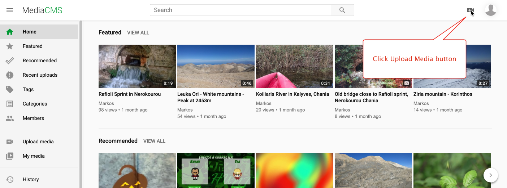

#### Upload Page

Clicking the _Upload Media_ button takes you to the upload page at a URL like this:

https://demo.mediacms.io/upload

#### Click Browse Button

Here you should click the _"Browse your files"_ button (or drag and drop a file from your desktop):

    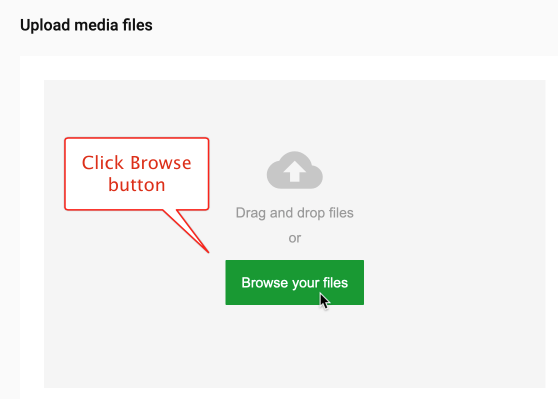

#### Select media file and click Open button

Select the media file that you want to upload and click the _"Open"_ button:

    

#### Wait for file to upload

Wait for the file to finish uploading:

    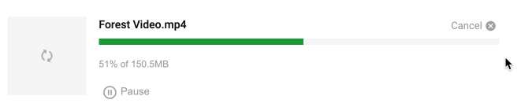

#### Pause uploading

If you want you can pause upload by clicking _Pause button_:

    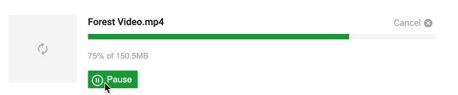

#### Continue uploading

Continue upload by clicking _Continue button_:

    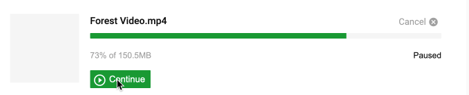

#### Wait for media to finish Processing

Wait for the media file to finish Processing:

    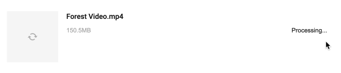

#### Click View media button

Click the View media button to open the media page:

    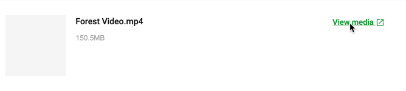

#### Media will be in the encoding queue

The media will take some time to finish encoding (MediaCMS will transcode the file to several formats and resolutions). Meanwhile you can edit the media file to add metadata.

#### Click Edit Media button

Click the EDIT MEDIA button to add metadata and configure the poster image:

    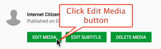

#### Add Metadata (Summary, Description etc.)

Make sure you fill in all the required fields, and try to complete as many of the non-required fields as possible. This ensures the database is populated with useful meta-data to help others access useful information about you and your video.

    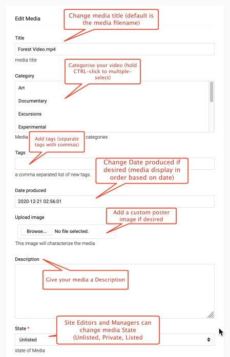

    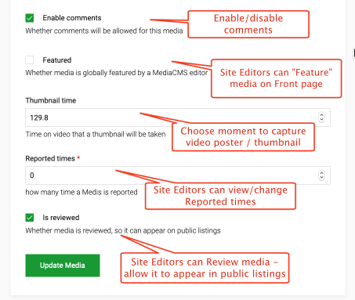

## Downloading media

MediaCMS offers a configurable option whereby users can make their media files available for download. Downloads are available for transcoded files, and the original file.

#### How To Enable Download

Visit the media view page and choose the EDIT MEDIA button.

Select the checkbox for "Allow Downloads"

#### How To Download Media

Visit the media view page and click the DOWNLOAD button below the video player.

    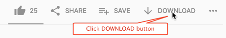

Choose the version you wish to download - a transcoded file or the original file:

    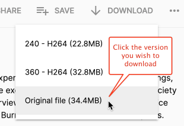

Choose Save File and click the OK button.

    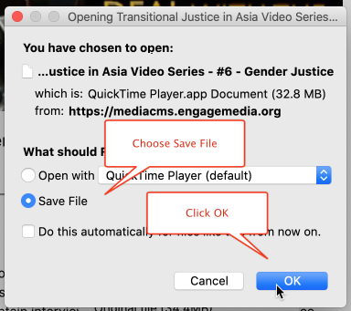

## Adding captions/subtitles

With MediaCMS you can add subtitles/captions to your video by uploading a subtitles file in the popular .vtt format.

### Visit Media Page & Click EDIT SUBTITLE Button

Visit the "single media page" for the media you wish to add subtitles/captions to and click the EDIT SUBTITLES button:

    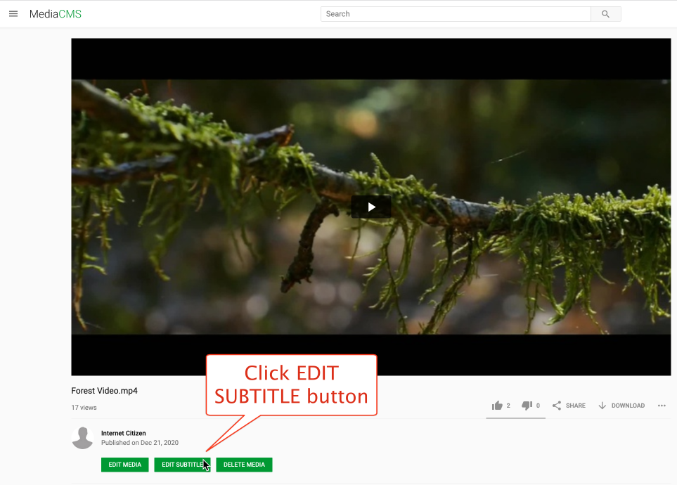

### Upload Subtitles in .vtt Format

Click the Language menu to select the correct language for your Subtitles/Captions file:

    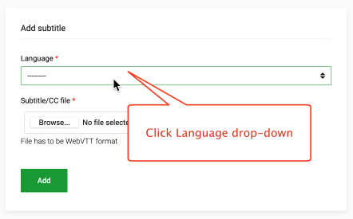

Choose the correct Language for your file:

    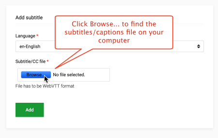

Click Browse to find a subtitles/captions file on your computer (if your file is not in the .vtt format, you may find a conversion service on the Internet):

    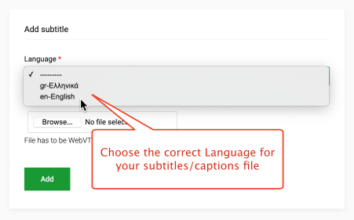

Choose a .vtt subtitles/captions file from your computer:

    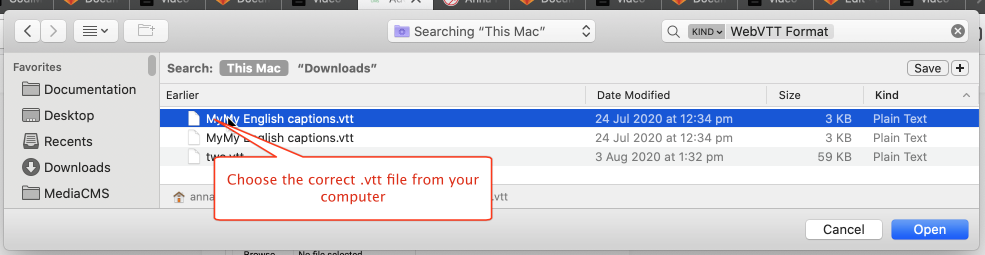

Click the Add button to add the file to your media:

    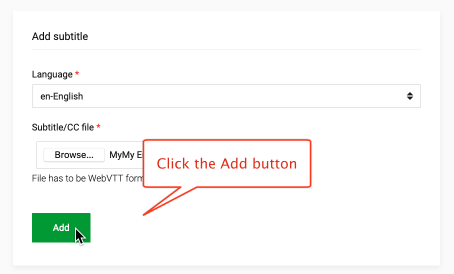

### View Subtitles/Captions in Video Player

You can now watch the captions/subtitles play back in the video player - and toggle display on/off by clicking the CC button:

    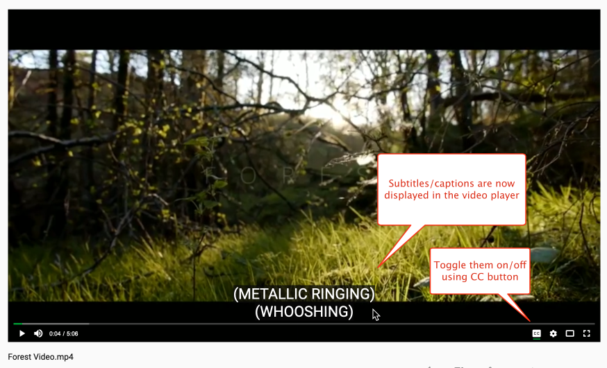

## Using Timestamps for sharing

### Using Timestamp in the URL

An additional GET parameter 't' can be added in video URL's to start the video at the given time. The starting time has to be given in seconds.

    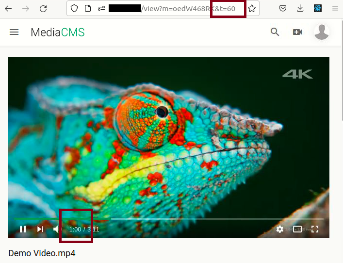

Additionally the share button has an option to generate the URL with the timestamp at current second the video is.

    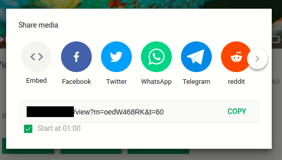

### Using Timestamp in the comments

Comments can also include timestamps. They are automatically detected upon posting the comment, and will be in the form of an hyperlink link in the comment. The timestamps in the comments have to follow the format HH:MM:SS or MM:SS

    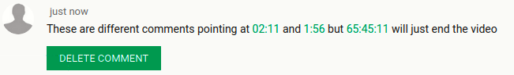

## Mentionning users in comments

Comments can also mention other users by tagging with '@'. This will open suggestion box showing usernames, and the selection will refine as the user continues typing.

Comments send with mentions will contain a link to the user page, and can be setup to send a mail to the mentionned user.

    
    
    
    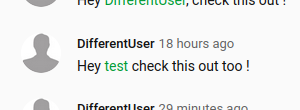

## Show comments in the Timebar

When enabled, comments including a timestamp will also be displayed in the current video Timebar as a little colorful dot. The comment can be previewed by hovering the dot (left image) and it will be displayed on top of the video when reaching the correct time (right image).

Only comments with correct timestamps formats (HH:MM:SS or MM:SS) will be picked up and appear in the Timebar.

    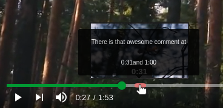
    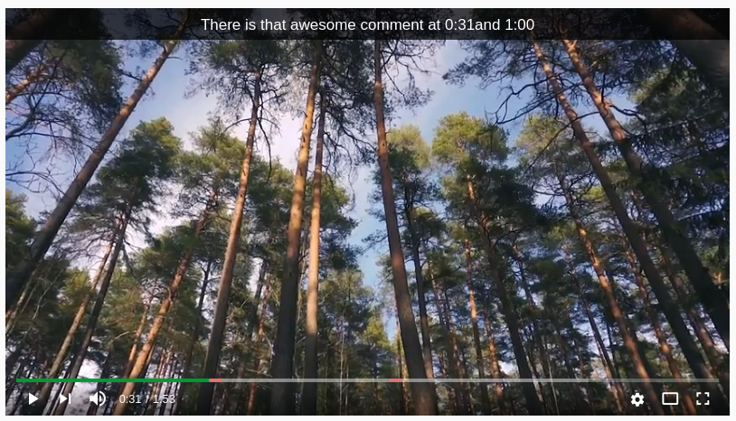

## Search media
How search can be used

## Share media
How to share media

## Embed media
How to use the embed media option

## Customize my profile options
Customize profile and channel

## Trim videos
Once a video is uploaded, you can trim it to create a new video or to replace the original one. You can also create segments of the video, which will be available as separate videos. Edit the video and click on the "Trime Video" option. If the original video has finished processing (encodings are created for all resolutions), then this is an action that runs instantly. If the original video hasn't processed, which is the case when you upload a video and edit it right away, then the trim action will trigger processing of the video and will take some time to finish. In all cases, you get to see the original video (or the trimmed versions) immediately, so you are sure of what you have uploaded or trimmed, with a message that the video is being processed.

